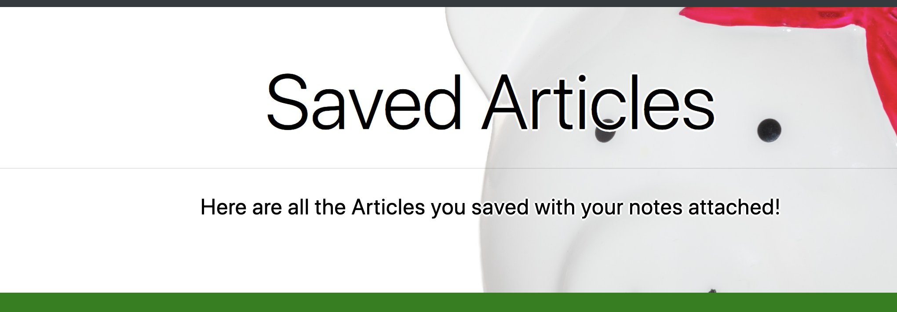

# Gaming-Scrape

This application will get the topic, summary, and link from a **video gaming** website and dispaly them.  The user can save an article and add a note to it which can be views later.

## Resources used

NPM used _(Node Package Manager)_: express, express-handlebars, axios, cheerio, and mongoose
Library, package or technology used: [JQuery](https://jquery.com/) and [Bootstrap](https://getbootstrap.com/)
Database: [MongoDB](https://www.mongodb.com)
[Heroku](https://www.heroku.com) is used to host the application.

## The great Scrape

At the homepage the user will click the **SCRAPE NEW ARTILES** button which will get the articles from another website without having to visit that website.  The articles will contain a _topic_, _summary_, and a _link_.  The user can click on the **article** which will give the user an option of adding a note to the article and save it.

#### Sample of Home Screen

## I'll read it later!

All the articles that the user stored and made notes on will be displayed here on the saved articles page.  The user can then view and delete the article that contained a note made by the user.

#### Sample of Saved Articles Screen

